# gobang
欸嘿嘿，一个AI五子棋项目

## 更新日志

2024-8-14 18:00
   训练轮次5500，模型学会横向三子的堵截，竖着未尝试，斜向不行，也会了连子，斜向/横向，如果你的设备算力足够可以接着训练，n_playout建议调大，我默认是2000，效果不太好
   第5500轮训练数据：
   | 属性 | 值 |
   | ---: | :--- |
   | kl散度 | 0.42568|
   | lr_multiplier(学习率乘数) | 0.088 |
   | loss | 2.84705 |
   | entropy(熵) | 2.75468 |
   | old_explained_var(旧解释方差) | 0.298 |
   | new_explained_var(新解释方差) | 0.895 |

   ---

   以下是两轮游玩截图，黑子玩家
   
   

2024-8-13 18:42
   好耶！！微重构，将收集与训练代码丢一起了，使用多进程收集数据，单进程训练，可以通过 -cn 指定进程数，默认是4个
    
   训练方式：`python train.py -cn 4(tips: 进程数, 可修改)`
    
   tips: 由于棋盘是15*15，所以数据量比较大，训练时间较长，建议使用GPU训练，目前我跑了差不多5天，损失率从6降低到了2.7左右，等我autoal上的余额消耗完，就上传最后的模型，效果比较差

2024-7-30 17:08
   环境重构，更换AI模型，使用AlphaZero算法

   模型结构（tips：残差块7个）

   

2024-7-29 19:25
   完成环境，完成基本功能，尝试了一个基础AI，未收敛

   训练数据：

   