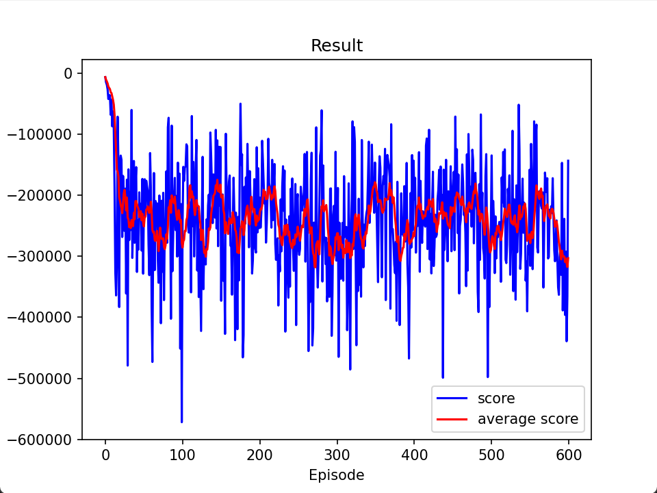

# gobang
欸嘿嘿，一个AI五子棋项目

## 更新日志

1. 2024-7-29 19:25
   完成环境，完成基本功能，尝试了一个基础AI，未收敛

   训练数据：

   

2. 2024-7-30 17:08
   环境重构，更换AI模型，使用AlphaZero算法

   模型结构（tips：残差块7个）

   

3. 2024-8-13 18:42
4. 好耶！！微重构，将收集与训练代码丢一起了，使用多进程收集数据，单进程训练，可以通过 -cn 指定进程数，默认是4个
    
   训练方式：`python train.py -cn 4(tips: 进程数, 可修改)`
    
   tips: 由于棋盘是15*15，所以数据量比较大，训练时间较长，建议使用GPU训练，目前我跑了差不多5天，损失率从6降低到了2.7左右，等我autoal上的余额消耗完，就上传最后的模型，效果比较差
